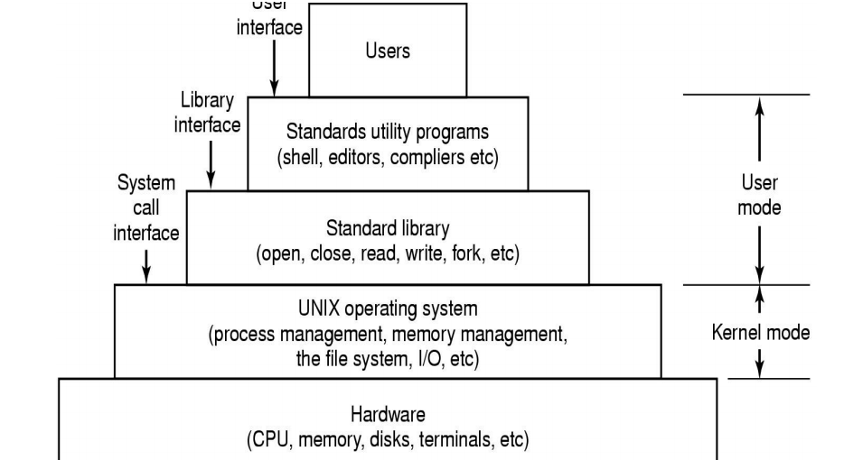

```{r setup, include=FALSE}
options(htmltools.dir.version = FALSE)
knitr::opts_chunk$set(
  fig.width=9, fig.height=3.5, fig.retina=3,
  out.width = "100%",
  cache = FALSE,
  echo = TRUE,
  message = FALSE, 
  warning = FALSE,
  hiline = TRUE
)
```

```{r xaringan-themer, include=FALSE, warning=FALSE}
library(xaringanthemer)
style_mono_light(base_color="#444f60", 
                  header_font_google=google_font("Atkinson Hyperlegible"),
                  text_font_google=google_font("Montserrat")
)
#style_duo_accent(
#  primary_color = "#1381B0",
#  secondary_color = "#FF961C",
#  inverse_header_color = "#FFFFFF"
#)
```

class: center, middle
<div class="toplogo">

</div>


# Debian GNU/Linux
Raphael Cobe (<a href="mailto:raphaelmcobe@gmail.com">raphaelmcobe@gmail.com</a>)
#### Advanced Institute for Artificial Intelligence

<div class="text-bottom">Agosto de 2021</div>


---
class: inverse center middle
<div class="toplogo">

</div>

# Sistemas  Operacionais
## Revisão

<div class="text-bottom">Debian GNU/Linux</div>


---
class: middle
<div class="toplogo">

</div>

## Sistemas Operacionais
#### O que é um sistema Operacional? 

* Difícil de definir com precisão
* Surgiram historicamente quando as pessoas precisavam resolver problemas associados ao uso de computadores.

**Grande parte da história do sistema operacional impulsionada por fatores de custo relativos de hardware e pessoas.**

<div class="text-bottom">Debian GNU/Linux</div>

---
class: middle
<div class="toplogo">

</div>

## Sistemas Operacionais
#### O que é um sistema Operacional? 
* O hardware começou muito caro em relação às pessoas e o custo relativo vem diminuindo desde então. 
* No início: Hardware caro, pessoal barato 
  * Objetivo: maximizar a utilização do hardware.
* Agora: Hardware barato, pessoas caras 
  * Objetivo: tornar mais fácil para as pessoas usarem o computador.

<div class="text-bottom">Debian GNU/Linux</div>

---
class:middle
<div class="toplogo">
  
</div>

## Sistemas Operacionais
#### Um pouco de história
* No início:
  * Computadores eram máquinas enormes, caras, difíceis de operar e manter. 
    * Usado em modo interativo por um usuário único. 
  * Interação em um nível muito baixo - botões do console, cartões no leitor de cartão, etc. 
  * **A interface é basicamente o hardware bruto**.
  
<div class="text-bottom">Debian GNU/Linux</div>

---
class:middle
<div class="toplogo">
  
</div>

## Sistemas Operacionais
#### Um pouco de história

**Problema:** Código para manipular dispositivos de E/S externos. É muito complexo e é uma das principais fontes de dificuldade de programação.

<div class="text-bottom">Debian GNU/Linux</div>
--

**Solução:** Construir uma biblioteca de sub-rotinas (drivers de dispositivos) para gerenciar a interação com os dispositivos de E/S. 
* A biblioteca é carregada na memória e permanece lá.

<div class="text-bottom">Debian GNU/Linux</div>

---
class: middle
<div class="toplogo">
  
</div>

## Sistemas Operacionais
#### Um pouco de história

* Década de 1940 - primeiras gerações
  * Os primeiros computadores digitais eletrônicos não tinham sistemas operacionais. 
  * Programas geralmente eram inseridos um bit por vez em fileiras de interruptores mecânicos. 

<div class="text-bottom">Debian GNU/Linux</div>

---
class: middle
<div class="toplogo">
  
</div>

## Sistemas Operacionais
#### Um pouco de história
* Década de 1950 - segunda geração
  * Introdução dos cartões perfurados. 
  * Primeiros sistemas operacionais no início dos anos 1950 para o IBM 701. 
      * Geralmente funcionava com um *job* de cada vez. 
      * **Sistemas de processamento em lote:** fluxo único porque os programas e dados eram enviados em  lotes.

<div class="text-bottom">Debian GNU/Linux</div>

---
class:middle
<div class="toplogo">
  
</div>

## Sistemas Operacionais
#### Um pouco de história

* Década de 1960 - Terceira Geração (sistemas em batch)
  * Executando vários *jobs* ao mesmo tempo.
  * **Multiprogramação**: vários trabalhos estão na memória principal ao mesmo tempo;
      * Particionar a memória em várias partes, com um trabalho diferente em cada partição. 
      * Enquanto um trabalho aguardava a conclusão de E/S, outro trabalho poderia estar usando a CPU.
  * **Time-sharing**: compartilhamento por tempo

<div class="text-bottom">Debian GNU/Linux</div>

---
class:middle
<div class="toplogo">
  
</div>

## Sistemas Operacionais
#### Um pouco de história

* Quarta Geração (1980 - atual)
  * Computador pessoal: desktops tão poderosos quanto os mainframes da década de 1970. 
  * Dois sistemas operacionais dominaram a cena do computador pessoal: 
      * **MS-DOS**, escrito pela Microsoft, Inc. para o IBM PC e outras máquinas que usam a CPU Intel 8088 e seus sucessores, e 
      * **UNIX**, que é dominante nos grandes computadores pessoais que usam o Motorola Família de CPU 6899.

<div class="text-bottom">Debian GNU/Linux</div>

---
class:middle
<div class="toplogo">
  
</div>

## Sistemas Operacionais
#### O papel do Sistema Operacional?
* **Fornecer abstrações**: O hardware possui recursos físicos de baixo nível com interfaces complicadas e idiossincráticas. 
  * Objetivo: tornar o computador mais fácil de usar.
  *  É uma **máquina estendida**
* **Fornece interface padronizda**: O Unix é executado em muitos sistemas de computador muito diferentes. 
  * Capacidade de portar programas entre sistemas com pouco esforço.
  
---
class:middle
<div class="toplogo">
  
</div>

## Sistemas Operacionais
#### O papel do Sistema Operacional?
* **Mediação do uso de recursos**: permitir que vários usuários compartilhem recursos de maneira justa, eficiente e segura.
  * Cada programa tem um **tempo e um espaço** no recurso
  
<div class="text-bottom">Debian GNU/Linux</div>

---
class:middle
<div class="toplogo">
  
</div>

## Sistemas Operacionais
#### Máquina Estendida
* Transformam o hardware pouco atraente em abstrações mais interessantes 
  * Esconde detalhes do hardware;
* Ex.: Um livro de 2007 que descreve a interface dos discos rígidos modernos que um programador deveria saber: ​
  * Tinha mais de **450 páginas**
  * Essa interface foi revista múltiplas vezes e é mais complicada do que em 2007.

<div class="text-bottom">Debian GNU/Linux</div>

---
class:middle
<div class="toplogo">
  
</div>

## Sistemas Operacionais
#### Gerenciador de Recursos
* Fornecer uma alocação ordenada e controlada de processadores, memórias, e dispositivos de E/S entre vários programas que compete por eles
* Se houver muitos pedidos de recursos possivelmente conflitantes
  * SO deve decidir em que pedidos serão alocados recursos
* No caso de um computador com múltiplos usuários:
  * O SO precisa evitar que usuários possam interferir uns nos outros
  * Prover proteção da memória, dispositivos de E/S e outros recursos
  
<div class="text-bottom">Debian GNU/Linux</div>

---
class: inverse center middle
<div class="toplogo">

</div>

# Sistemas Operacionais
## Processos e Threads

<div class="text-bottom">Debian GNU/Linux</div>


---
class:middle
<div class="toplogo">
  
</div>

## Sistemas Operacionais
#### Processos 
* De forma genérica, representa um **fluxo de execução**;
* Processo não é o mesmo que programa:
  * Um processo é uma entidade 'ativa': 
      * Código de programa carregado na memória para execução
  * Programa é um algoritmo expresso em linguagem de programação 
      * **Entidade passiva**, pois reside na memória secundária, como o conteúdo de um arquivo armazenado no disco. 
      * Um programa pode ter vários processos.

<div class="text-bottom">Debian GNU/Linux</div>

---
class:middle
<div class="toplogo">
  
</div>

## Sistemas Operacionais
#### Processos
* *Process control block* - PCB (contexto):
  * Valor atual do contador do programa (PC);
  * Conteúdo dos registradores;
  * A pilha de processo (SP) que contém dados temporários, como parâmetro de sub-rotina e endereço de retorno.
  * Memória (variáveis globais e memória alocada dinamicamente)
  * Tabela de arquivos abertos;


<div class="text-bottom">Debian GNU/Linux</div>

---
class:middle
<div class="toplogo">
  
</div>

## Sistemas Operacionais
#### Processos
* Uniprogramação (apenas um processo de cada vez) vs Multiprogramação (vários processos ao mesmo tempo)
  * *Preemptive multitasking*: executa um processo por um tempo, depois tira a CPU desse processo e permite que outro processo seja executado;
* Processos são separados - **nenhum processo pode afetar diretamente o estado de outro processo**
* Mudanças de contexto;


<div class="text-bottom">Debian GNU/Linux</div>

---
class:top
<div class="toplogo">
  
</div>

## Sistemas Operacionais
#### Processos - Ciclo de Vida

<div style="text-align:center;"></div>

<div class="text-bottom">Debian GNU/Linux</div>

---
class:middle
<div class="toplogo">
  
</div>

## Sistemas Operacionais
#### Kernel
* Núcleo do sistema operacional
* Primeiro programa do sistema operacional
  * Carregado na memória primária para iniciar a operação do sistema. 
  * Mantido na memória principal até que o sistema seja desligado. 
* Essencialmente **converte comandos do usuário em algo que a máquina entenda**
* Ponte entre o software de aplicação do sistema e seu hardware;
* Responsável pelo **gerenciamento de processos**, **sistemas de arquivo**, **memória**, **permissões de usuários**;

<div class="text-bottom">Debian GNU/Linux</div>

---
class:middle
<div class="toplogo">
  
</div>

## Sistemas Operacionais
#### Espaço do Kernel vs Espaço do Usuário

* Mantido e carregado em um espaço de memória separado
    * **Espaço protegido do Kernel**: protegido contra acesso por programas aplicativos
* Outros programas de aplicativosusam um espaço de memória separado chamado **espaço do usuário**.
* O kernel fornece uma API para esses aplicativos por meio de **chamadas de sistema**;


<div class="text-bottom">Debian GNU/Linux</div>


---
class: middle
background-image: url("img/white.png")
background-size: cover

<div class="toplogo">
  
</div>

## Sistemas Operacionais
#### Espaço do Kernel vs Espaço do Usuário

<div style="text-align:center;"></div>

<div class="text-bottom">Debian GNU/Linux</div>

---
class:middle
background-image: url("img/white.png")
background-position: center
background-size: cover
<div class="toplogo">
  
</div>

## Sistemas Operacionais
#### Espaço do Kernel vs Espaço do Usuário
<div style="text-align:center;"></div>
<div class="text-bottom">Debian GNU/Linux</div>

---
class:middle
<div class="toplogo">
  
</div>

## Sistemas Operacionais
#### Threads
* Unidade básica que o escalonador de processo usa para permitir que os aplicativos utilizem a CPU.
* Tem sua própria pilha e junto com os registradores determina o estado de execução da thread;
* Executado no contexto de um processo e **todos os threads no mesmo processo compartilham os recursos**;
* Tthreads compartilham partes de seu estado. 
  * Leitura e escrita na mesma memória. 
  * Cada thread ainda tem seus próprios registradores e pilha
<div class="text-bottom">Debian GNU/Linux</div>

---
class:middle
<div class="toplogo">
  
</div>

## Sistemas Operacionais
#### Processo de Inicialização

<div class="text-bottom">Debian GNU/Linux</div>


---
## Typography

Text can be **bold**, _italic_, ~~strikethrough~~, or `inline code`.

[Link to another slide](#colors).

### Lorem Ipsum

Dolor imperdiet nostra sapien scelerisque praesent curae metus facilisis dignissim tortor. 
Lacinia neque mollis nascetur neque urna velit bibendum. 
Himenaeos suspendisse leo varius mus risus sagittis aliquet venenatis duis nec.

- Dolor cubilia nostra nunc sodales

- Consectetur aliquet mauris blandit

- Ipsum dis nec porttitor urna sed

---
name: colors

## Colors

.left-column[
Text color

[Link Color](#3)

**Bold Color**

_Italic Color_

`Inline Code`
]

.right-column[
Lorem ipsum dolor sit amet, [consectetur adipiscing elit (link)](#3), 
sed do eiusmod tempor incididunt ut labore et dolore magna aliqua. 
Erat nam at lectus urna.
Pellentesque elit ullamcorper **dignissim cras tincidunt (bold)** lobortis feugiat. 
_Eros donec ac odio tempor_ orci dapibus ultrices. 
Id porta nibh venenatis cras sed felis eget velit aliquet.
Aliquam id diam maecenas ultricies mi.
Enim sit amet 
`code_color("inline")`
venenatis urna cursus eget nunc scelerisque viverra.
]

---

# Big Topic or Inverse Slides `#`

## Slide Headings `##`

### Sub-slide Headings `###`

#### Bold Call-Out `####`

This is a normal paragraph text. Only use header levels 1-4.

##### Possible, but not recommended `#####`

###### Definitely don't use h6 `######`

---

# Left-Column Headings

.left-column[
## First

## Second

## Third
]

.right-column[
Dolor quis aptent mus a dictum ultricies egestas.

Amet egestas neque tempor fermentum proin massa!

Dolor elementum fermentum pharetra lectus arcu pulvinar.
]

---
class: inverse center middle

# Topic Changing Interstitial

--

```
class: inverse center middle
```

---
layout: true

## Blocks

---

### Blockquote

> This is a blockquote following a header.
>
> When something is important enough, you do it even if the odds are not in your favor.

---

### Code Blocks

#### R Code

```{r eval=FALSE}
ggplot(gapminder) +
  aes(x = gdpPercap, y = lifeExp, size = pop, color = country) +
  geom_point() +
  facet_wrap(~year)
```

#### JavaScript

```js
var fun = function lang(l) {
  dateformat.i18n = require('./lang/' + l)
  return true;
}
```

---

### More R Code

```{r eval=FALSE}
dplyr::starwars %>% dplyr::slice_sample(n = 4)
```

---

```{r message=TRUE, eval=requireNamespace("cli", quietly = TRUE)}
cli::cli_alert_success("It worked!")
```

--

```{r message=TRUE}
message("Just a friendly message")
```

--

```{r warning=TRUE}
warning("This could be bad...")
```

--

```{r error=TRUE}
stop("I hope you're sitting down for this")
```


---
layout: true

## Tables

---
exclude: `r if (requireNamespace("tibble", quietly=TRUE)) "false" else "true"`

```{r eval=requireNamespace("tibble", quietly=TRUE)}
tibble::as_tibble(mtcars)
```

---

```{r}
knitr::kable(head(mtcars), format = 'html')
```

---
exclude: `r if (requireNamespace("DT", quietly=TRUE)) "false" else "true"`

```{r eval=requireNamespace("DT", quietly=TRUE)}
DT::datatable(head(mtcars), fillContainer = FALSE, options = list(pageLength = 4))
```

---
layout: true

## Lists

---

.pull-left[
#### Here is an unordered list:

*   Item foo
*   Item bar
*   Item baz
*   Item zip
]

.pull-right[

#### And an ordered list:

1.  Item one
1.  Item two
1.  Item three
1.  Item four
]

---

### And a nested list:

- level 1 item
  - level 2 item
  - level 2 item
    - level 3 item
    - level 3 item
- level 1 item
  - level 2 item
  - level 2 item
  - level 2 item
- level 1 item
  - level 2 item
  - level 2 item
- level 1 item

---

### Nesting an ol in ul in an ol

- level 1 item (ul)
  1. level 2 item (ol)
  1. level 2 item (ol)
    - level 3 item (ul)
    - level 3 item (ul)
- level 1 item (ul)
  1. level 2 item (ol)
  1. level 2 item (ol)
    - level 3 item (ul)
    - level 3 item (ul)
  1. level 4 item (ol)
  1. level 4 item (ol)
    - level 3 item (ul)
    - level 3 item (ul)
- level 1 item (ul)

---
layout: true

## Plots

---

```{r plot-example, eval=requireNamespace("ggplot2", quietly=TRUE)}
library(ggplot2)
(g <- ggplot(mpg) + aes(hwy, cty, color = class) + geom_point())
```

---

```{r plot-example-themed, eval=requireNamespace("ggplot2", quietly=TRUE)}
g + xaringanthemer::theme_xaringan(text_font_size = 16, title_font_size = 18) +
  ggtitle("A Plot About Cars")
```

---
layout: false

## Square image

<center></center>

.footnote[GitHub Octocat]

---

### Wide image


.footnote[Wide images scale to 100% slide width]

---

## Two images

.pull-left[

]

.pull-right[

]

---

### Definition lists can be used with HTML syntax.

<dl>
<dt>Name</dt>
<dd>Godzilla</dd>
<dt>Born</dt>
<dd>1952</dd>
<dt>Birthplace</dt>
<dd>Japan</dd>
<dt>Color</dt>
<dd>Green</dd>
</dl>

---
class: center, middle

# Thanks!

Slides created via the R packages:

[**xaringan**](https://github.com/yihui/xaringan)<br>
[gadenbuie/xaringanthemer](https://github.com/gadenbuie/xaringanthemer)

The chakra comes from [remark.js](https://remarkjs.com), [**knitr**](http://yihui.name/knitr), and [R Markdown](https://rmarkdown.rstudio.com).
