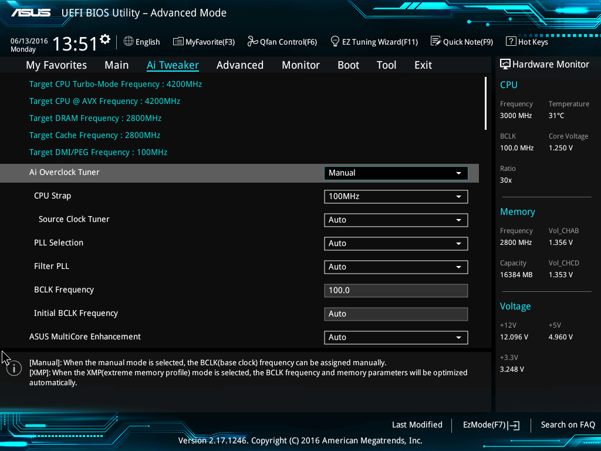

```{r setup, include=FALSE}
options(htmltools.dir.version = FALSE)
knitr::opts_chunk$set(
  fig.width=9, fig.height=3.5, fig.retina=3,
  out.width = "100%",
  cache = FALSE,
  echo = TRUE,
  message = FALSE, 
  warning = FALSE,
  hiline = TRUE
)
```

```{r xaringan-themer, include=FALSE, warning=FALSE}
library(xaringanthemer)
style_mono_light(base_color="#444f60", 
                  header_font_google=google_font("Atkinson Hyperlegible"),
                  text_font_google=google_font("Montserrat")
)
#style_duo_accent(
#  primary_color = "#1381B0",
#  secondary_color = "#FF961C",
#  inverse_header_color = "#FFFFFF"
#)
```

class: center, middle
<div class="toplogo">

</div>


# Debian GNU/Linux
Raphael Cobe (<a href="mailto:raphaelmcobe@gmail.com">raphaelmcobe@gmail.com</a>)
#### Advanced Institute for Artificial Intelligence

<div class="text-bottom">Agosto de 2021</div>

---
class: inverse center middle
<div class="toplogo">

</div>

# Sistemas  Operacionais
## Revisão

<div class="text-bottom">Debian GNU/Linux</div>

---
class:middle
<div class="toplogo">
  
</div>

## Sistemas Operacionais
#### Processo de Inicialização

1. BIOS/UEFI 
1. Bootloader
1. Carregamento do Kernel (*mini-debian*)
1.  `initd/systemd` (*full-debian*)

<div class="text-bottom">Debian GNU/Linux</div>

---
class:middle
<div class="toplogo">
  
</div>

## Sistemas Operacionais
#### Processo de Inicialização - BIOS
* BIOS (Firmware) gravado na EPROM;
* *Power On Self Test* (POST) - Detecção de periféricos; 
* Executado no modo de processador de 16 bits e tem apenas 1 MB de espaço para execução;
* Tamanho de discos limitado a 2,2 TB;


<div class="text-bottom">Debian GNU/Linux</div>

---
class:middle
<div class="toplogo">
  
</div>

## Sistemas Operacionais
#### Processo de Inicialização - BIOS

<div style="text-align:center;"></div>

<div class="text-bottom">Debian GNU/Linux</div>

---
class:middle
<div class="toplogo">
  
</div>

## Sistemas Operacionais
#### Processo de Inicialização - UEFI
* *Unified Extensible Firmware Interface*
* Firmware com capacidade de leitura de partes específicas do disco
  * Armazena todos os dados sobre inicialização e inicialização em um arquivo `.efi`, em vez de armazená-los no firmware;
  * *EFI System Partition* (ESP)
  
<div class="text-bottom">Debian GNU/Linux</div>

---
class:middle
<div class="toplogo">
  
</div>

## Sistemas Operacionais
#### Processo de Inicialização - UEFI  
* Resolve alguns problemas com a BIOS:
  * Tamanhos de unidade de até **9 zettabytes**;
  * Tempo de inicialização **mais rápido**;
  * Segurança como ***Secure Boot***
      * Impede o computador de inicializar a partir de aplicativos não autorizados / não assinados. 
      * Ajuda a prevenir rootkits
  * Executado em **modo 32 ou 64 bits**

<div class="text-bottom">Debian GNU/Linux</div>

---
class:middle
<div class="toplogo">
  
</div>

#### Processo de Inicialização - UEFI

<div style="text-align:center;"></div>

<div class="text-bottom">Debian GNU/Linux</div>


---
class:middle
<div class="toplogo">
  
</div>

## Sistemas Operacionais
#### Processo de Inicialização
* Gerenciador de Boot:
  * **GR**and **U**nified **B**ootloader version 2 (GRUB2)
  * Escolha de qual Kernel vai ser inicializado;
  * Ele carrega a imagem do kernel do sistema e a imagem `initrd` para a memória e passa o controle para eles;
* Inicialização do Kernel
  * O processo `/init`
  * `initramfs` - sistema de arquivos temporário usado pelo kernel (imagem `initrd`);


<div class="text-bottom">Debian GNU/Linux</div>

---
class:middle
<div class="toplogo">
  
</div>

## Sistemas Operacionais
#### Processo de Inicialização
* `systemd`
  * O sistema de arquivos raiz é trocado daquele na memória para aquele no sistema de arquivos do disco rígido real;
  * O processo `/sbin/init` (`systemd`)
  * `/lib/systemd/system`: configuração padrão do SO;
  * `/etc/systemd/system`: arquivos de configuração do administrador do sistema;
  * Inicialização de serviços (rede, montagem de discos, etc.);

<div class="text-bottom">Debian GNU/Linux</div>

---
class: center, middle, inverse
<div class="toplogo">
  
</div>

# Debian GNU/Linux
## Projeto Debian


<div class="text-bottom">Debian GNU/Linux</div>

---
class:middle
<div class="toplogo">
  
</div>

## Debian GNU/Linux
#### O que é?
* Sistema operacional **completo**, incluindo software para instalação e gerenciamentobaseados no kernel Linux e software livre (especialmente aqueles do projeto GNU);
* Criado em 1993 por Ian Murdock;
* [Debian Manifesto](https://www.debian.org/doc/manuals/project-history/manifesto.en.html)
* 10 arquiteturas de hardware oficialmente suportadas;
* *Meta-distribuição*;

<div class="text-bottom">Debian GNU/Linux</div>


---
class:middle
<div class="toplogo">
  
</div>

## Debian GNU/Linux
#### Organização do projeto
* Desenvolvedores Debian (1023 membros)
  * Responsáveis por pelo menos um pacote;
  * Organizados em [times](https://wiki.debian.org/Teams);
* Debian [Policy](https://bugs.debian.org/debian-policy)
  * Garante regras de qualidade e garantem interoperabilidade de pacotes;
  * Guidelines técnicos para empacotamento;

<div class="text-bottom">Debian GNU/Linux</div>

---
class:middle
<div class="toplogo">
  
</div>

## Debian GNU/Linux
#### Desenvolvedores

.center[]

<div class="text-bottom">Debian GNU/Linux</div>

---
class:middle
<div class="toplogo">
  
</div>

## Debian GNU/Linux
#### Mantendo um Pacote
* A manutenção de pacotes é uma atividade relativamente controlada, muito documentada ou mesmo regulamentada. 
* Deve, de fato, cumprir todos os padrões estabelecidos pela *Debian Policy*;
* Manter um pacote: 
  * Empacotar um programa;
  * Definir o processo de instalação
      * Uma vez instalado, este programa deve funcionar corretamente;
  * O resultado desta operação é salvo em um arquivo `.deb`;
  * Atualizações futuras de novos releases *upstream*;

<div class="text-bottom">Debian GNU/Linux</div>

---
class:middle
<div class="toplogo">
  
</div>

## Debian GNU/Linux
#### Organização do projeto
* Papel dos usuários
  * [Bug report](https://www.debian.org/Bugs/);
  * [Tradução](https://www.debian.org/international/) e documentação;
  * Envio de correções de bugs

<div class="text-bottom">Debian GNU/Linux</div>

---
class:middle
<div class="toplogo">
  
</div>

## Debian GNU/Linux
#### Ciclo de vida de releases
* 3 a 6 versões de cada programa: 
  * **Experimental**: software ainda em desenvolvimento;
  * **Unstable**: Distribuição “de ponta” escolhida por usuários que estão mais preocupados em ter pacotes atualizados do que preocupados com bugs graves;
  * **Testing**: ausência de bugs críticos, compilando em todas as arquiteturas;
      * Período de *Freeze*; 
  * **Stable**: quando o instalador está pronto e quando nenhum programa em Teste tem quaisquer bugs críticos conhecidos;
  * **Oldstable** e **Oldoldstable** (LTSs)

<div class="text-bottom">Debian GNU/Linux</div>

---
class:middle
<div class="toplogo">
  
</div>

## Debian GNU/Linux
#### Ciclo de vida de releases

* Debian 12 (bookworm) - testing - sem data de lançamento;
* Debian 11 (bullseye) - versão estável atual
* Debian 10 (buster) - versão oldstable atual
* Debian 9 (stretch) - versão oldoldstable, com suporte LTS
* Debian 8 (jessie) - lançamento arquivado, com suporte LTS estendido
* Debian 7 (wheezy) - versão estável obsoleta
* Debian 6.0 (squeeze) - versão estável obsoleta
* Debian GNU / Linux 5.0 (lenny) - versão estável obsoleta
* ...

<div class="text-bottom">Debian GNU/Linux</div>

---
class:middle center inverse
<div class="toplogo">
  
</div>

# Debian GNU/Linux
## Instalação

<div class="text-bottom">Debian GNU/Linux</div>

---
class:middle
<div class="toplogo">
  
</div>

## Debian GNU/Linux
#### Particionamento
<div style="text-align:center;"></div>

<div class="text-bottom">Debian GNU/Linux</div>

---
class:middle
<div class="toplogo">
  
</div>

## Debian GNU/Linux
#### Particionamento
* Particionamento Guiado:
  * “Todos os arquivos em uma partição”: toda a árvore do sistema Linux é armazenada em um único sistema de arquivos correspondendo ao diretório raiz `/`
      * Sistemas pessoais ou de usuário único.
  * “Partição `/home` separada”: divide a hierarquia de arquivos em duas: uma partição contém o sistema Linux (`/`), e a segunda contém “diretórios pessoais”;
  * Separe as partições `/home`, `/var` e `/tmp` ”, é apropriado para servidores e sistemas multiusuário;

<div class="text-bottom">Debian GNU/Linux</div>

---
class:middle
<div class="toplogo">
  
</div>

## Debian GNU/Linux
#### Sistemas de Arquivo
* Definem como os dados se organizam no disco;
  * e.g., ext4, ext3, ReiserFS, btrfs;
* *Journal*: possibilita o retorno a um estado consistente anterior após uma interrupção abrupta, sem analisar completamente todo o disco;
  * Mantém histórico de ações tomadas pelo Sistema de arquivos;
    * Em caso de falha, consegue reexecutar a última instrução;
    * Em caso de sistema de arquivos corrompido, se descartam algumas operações;

<div class="text-bottom">Debian GNU/Linux</div>

---
class:middle
<div class="toplogo">
  
</div>

## Debian GNU/Linux
#### Logical Volume Manager - LVM
* Criar partições lógicas (virtuais) que podem ocupar vários discos;
* Redimensionar as partições existentes a qualquer momento.
  * Possivelmente após adicionar um disco adicional quando necessário;
* *Physical Volumes* (PV), *Volume Groups* (VG) e *Logical Volumes* (LV);


<div class="text-bottom">Debian GNU/Linux</div>

---
class: center, middle
<div class="toplogo">
  
</div>

# Obrigado!

Slides Criados utilizando pacotes R:

[**xaringan**](https://github.com/yihui/xaringan)<br>
[gadenbuie/xaringanthemer](https://github.com/gadenbuie/xaringanthemer)<br>
[remark.js](https://remarkjs.com), [**knitr**](http://yihui.name/knitr) e [R Markdown](https://rmarkdown.rstudio.com).

<div class="text-bottom">Debian GNU/Linux</div>